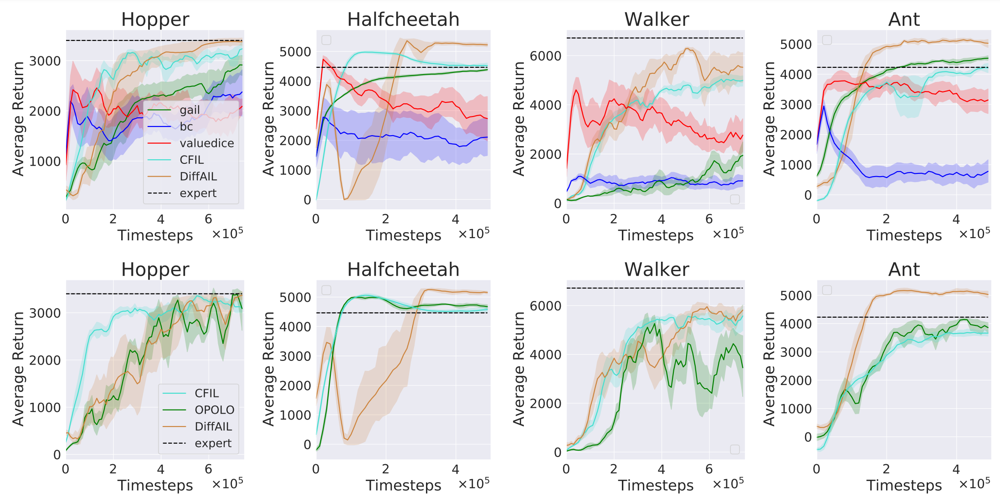

# DiffAIL:Diffusion Adversarial Imitation Learning

This repository contains the source code for "DiffAIL:Diffusion Adversarial Imitation Learning":
[https://arxiv.org/abs/2312.06348](https://arxiv.org/abs/2312.06348)

**Accepted at AAAI 2024.**

# Environments

DiffAIL is evaluated  on MuJoCo continuous control tasks in OpenAI gym. It is trained using PyTorch 1.11.0+cu113 and Python
3.9.

Install Dependencies
```
pip install -r requirements.txt
```
You will also need to install Mujoco and use a valid license. Follow the install instructions [here](https://github.com/openai/mujoco-py).

# method
Building on the diffusion model's superior ability to learn data distribution, we present a new method called Diffusion Model Loss as a reward
function for Generative Adversarial Imitation Learning (DiffAIL) in this work. DiffAIL employs the same framework as traditional AIL but incorporates
the diffusion model's learning loss. By combining the diffusion model's loss with AIL, DiffAIL enables the discriminator to accurately capture both 
expert demonstration and policy data distributions, facilitating the successful identification of expert-level behaviours that were previously unseen. 

# Dataset
All the dataset files are under ./demos. Those files have been compressed, you need to decompress them to "./demo"

# Usage  


The paper results can be reproduced by running:
```
python ./run_experiment.py -e "./exp_specs/ddpm_halfcheetah.yaml" -g 0  # for DiffAIL
python ./run_experiment.py -e "./exp_specs/gail_halfcheetah.yaml" -g 0  # for Gail
```

The algorithms we used BC, Valuedice, CFIL and OPOLO can be found from the following sources:

BC+Valuedice[(code)](https://github.com/google-research/google-research/tree/master/value_dice) : Imitation Learning via Off-Policy Distribution Matching[(paper)](https://arxiv.org/abs/1912.05032)  
CFIL[(code)](https://github.com/gfreund123/cfil) : A Coupled Flow Approach to Imitation Learning[(paper)](https://arxiv.org/abs/2305.00303)  
OPOLO[(code)](https://github.com/illidanlab/opolo-code) : Off-Policy Imitation Learning from Observations[(paper)](https://arxiv.org/abs/2102.13185)  

# Result
Top: Learning curve for different sota imitation learning algorithms with 1 trajectory 5 five seeds in the standard
state-action setting. Bottom: Learning curve for different sota imitation learning algorithms with one trajectory over five seeds
in the state-only setting. The x-axis denotes timesteps, and the y-axis denotes the average return. The shadow areas represent
the standard deviation.
&nbsp;
<p align="center">

</p>


# Acknowledgements
This repo relies on the following existing codebases:
- The diffusion model variant  based on [Diffusion Q](https://github.com/zhendong-wang/diffusion-policies-for-offline-rl)
- The Adversarial Imitation Learning framework is adapted from [here](https://github.com/Ericonaldo/ILSwiss)

# Citation
If you use this code for your research, please consider citing the paper:
```
@article{wang2023diffail,
  title={DiffAIL: Diffusion Adversarial Imitation Learning},
  author={Wang, Bingzheng and Wu, Guoqiang and Pang, Teng and Zhang, Yan and Yin, Yilong},
  journal={arXiv preprint arXiv:2312.06348},
  year={2023}
}

```
